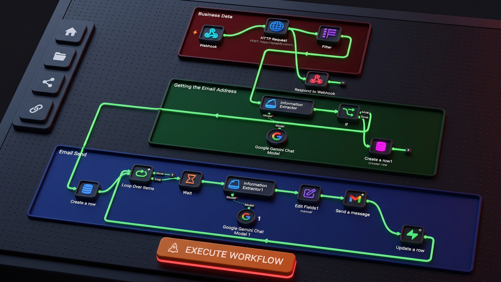

# LeadAgent — Autonomous B2B Lead Generation & AI Outreach Platform

[](https://react.dev/)
[](https://vitejs.dev/)
[](https://fastapi.tiangolo.com/)
[](https://www.python.org/)
[](https://tailwindcss.com/)
[](https://supabase.com/)
[](https://n8n.io/)

A modern, full-stack B2B SaaS platform that automates the entire outbound sales prospecting cycle: geospatial business discovery, deep contact enrichment (Verified Emails, Phone Numbers, LinkedIn, Instagram, Facebook), AI data cleaning, and personalized cold email outreach.

<p align="center">
  
</p>

---

## 🌟 Key Features

- **Geospatial & B2B Lead Scraper:** Target businesses by industry, location, and volume using high-speed crawlers.
- **Deep Contact Enrichment:** Scrapes corporate websites to extract primary business email addresses, direct phone numbers, and official social media handles.
- **AI Data Extraction & Verification:** Evaluates discovered emails and prioritizes departmental inboxes (`info@`, `contact@`, `sales@`) over generic noise.
- **Per-Campaign Outbound Email Infrastructure (BYOK Vault):** Connect Resend, Brevo, SendGrid, or Custom SMTP per campaign. API keys are stored securely with live connection diagnostics, test email sending, and domain SPF/DKIM verification assistance.
- **Pre-flight Outbound Launch Protection:** Prevents triggering search or prospecting until outbound email credentials and sender identity are verified and configured.
- **Real-Time Prospecting Milestone Tracker:** Live tracking modal monitoring the 4 key discovery stages (Scraping, Contact Enrichment, AI Email Pitch Generation, Lead Registration) backed by resilient database polling and background minimization.
- **Unified 5-Tone Copywriting Engine:** Standardized cold outreach styles (`Professional`, `Casual`, `Urgent`, `Consultative`, `Creative`) with badges and descriptions available across campaign creation, settings, and launch.
- **Interactive Email Preview Modal:** Inspect exact outbound subject lines, email bodies, dispatch timestamps, and status badges directly within campaign workspaces.
- **Interactive Analytics Dashboard:** Real-time metrics grid tracking discovery rates, dispatch percentages, and conversion timelines.
- **Live Event Audit Feed:** Chronological transaction log recording every search, extraction, and outbound communication event.
- **Multi-Tenant Security:** Powered by Supabase Auth and PostgreSQL Row Level Security (RLS) for complete workspace isolation.

---

## 🏗️ System Architecture

```text
                           [ Client Browser ]
                                   │
                                   ▼
                    [ React 19 Frontend (Vite) ]
                                   │
             ┌─────────────────────┴─────────────────────┐
             ▼                                           ▼
   [ FastAPI Backend ]                           [ n8n Automation Engine ]
   (Port 8000 REST API)                         (Webhook: lead-machine)
   ├── Auth & Vault Creds                                │
   ├── Outbound Integrations                             ▼
   └── Campaigns & Leads                         [ Apify Cloud API ]
             │                               (compass~crawler-google-places)
             │                                           │
             ▼                                           ▼
   [ Supabase PostgreSQL ] ◄────────────── [ Outbound Email Providers ]
  (Auth, Vault, Realtime DB)               (Resend, Brevo, SendGrid, SMTP)
```

---

## 📂 Project Structure

```text
automate-lead-generation/
├── backend/                   # FastAPI application
│   ├── routers/               # API endpoints (leads, campaigns, email_integrations, auth, admin)
│   │   ├── email_integrations.py # BYOK email providers, vault credentials & live testing
│   │   ├── campaigns.py       # Campaign management & launch dispatch
│   │   ├── leads.py           # Lead enrichment & verification
│   │   ├── webhook.py         # n8n webhook receiver & callbacks
│   │   └── admin.py           # Admin health diagnostics & audit logs
│   ├── schema_campaign_email_integrations.sql # SQL migration for vault & integrations
│   ├── config.py              # Environment configuration & settings
│   ├── database.py            # Supabase client integration
│   ├── main.py                # Application entrypoint & CORS middleware
│   ├── requirements.txt       # Python dependencies
│   └── .env.example           # Backend environment template
├── docs/                      # Architectural documentation
│   ├── project_overview_and_roadmap.md  # Deep dive & future milestones
│   └── vps_deployment_guide.md          # Docker, Nginx, and VPS setup
├── public/                    # Static assets & icons
├── src/                       # React frontend source code
│   ├── assets/                # Images & SVGs
│   ├── components/            # UI components (CampaignModal, ProspectingProgressModal, tables)
│   ├── context/               # Authentication & global application state
│   ├── data/                  # Static constants & unified email tones (emailTones.js)
│   ├── lib/                   # Supabase client setup
│   ├── pages/                 # Route pages (Dashboard, Campaigns, CampaignSettings, Audit Log)
│   └── utils/                 # Validation & string parsers
├── .env.example               # Frontend environment template
├── .gitignore                 # Protected secrets & artifact exclusion rules
├── package.json               # Node.js dependencies & scripts
├── tailwind.config.js         # Design system & color tokens
└── vite.config.js             # Build & bundler configuration
```

---

## 🚀 Quick Start (Local Development)

### Prerequisites
- **Node.js** v18.0 or higher
- **Python** v3.11 or v3.12
- **Supabase** account (Free tier supported)

---

### 1. Database Schema Setup
Run the SQL migration script in your **Supabase SQL Editor** to initialize the Vault and Campaign Integrations tables:
- Execute `backend/schema_campaign_email_integrations.sql`

---

### 2. Environment Configuration

#### Frontend Environment:
Create a `.env` file in the project root:
```bash
cp .env.example .env
```
Edit `.env`:
```env
VITE_SUPABASE_URL=https://your-project.supabase.co
VITE_SUPABASE_ANON_KEY=your-supabase-anon-key
```

#### Backend Environment:
Create a `.env` file inside the `backend/` directory:
```bash
cp backend/.env.example backend/.env
```
Edit `backend/.env`:
```env
SUPABASE_URL=https://your-project.supabase.co
SUPABASE_ANON_KEY=your-supabase-anon-key
SUPABASE_SERVICE_ROLE_KEY=your-supabase-service-role-key
N8N_WEBHOOK_URL=https://workflow.yourdomain.com/webhook/lead-machine
FRONTEND_URL=http://localhost:5173
PORT=8000
```

---

### 3. Frontend Setup

```bash
# Install dependencies
npm install

# Start local development server
npm run dev
```
The application will be accessible at `http://localhost:5173`.

---

### 4. Backend Setup

```bash
# Navigate to backend and install requirements
pip install -r backend/requirements.txt

# Start the FastAPI server
python -m uvicorn backend.main:app --host 127.0.0.1 --port 8000 --reload
```
API documentation and Swagger UI will be available at `http://127.0.0.1:8000/docs`.

---

### 5. Workflow Engine (n8n) Setup
1. Launch or self-host your n8n workflow engine instance.
2. Configure a webhook node to listen on `/webhook/lead-machine`.
3. Provide the webhook URL in `backend/.env` under `N8N_WEBHOOK_URL`.

---

## 📖 Deployment & Documentation

- 🚀 **[VPS Deployment Guide](docs/vps_deployment_guide.md):** Complete walkthrough for deploying on Ubuntu using Docker Compose, Nginx reverse proxy, and Let's Encrypt SSL.
- 📋 **[Project Overview & Roadmap](docs/project_overview_and_roadmap.md):** Architectural specifications, feature breakdown, and upcoming expansion milestones (SendGrid, SES, Mailgun, and custom domain email rotation).

---

## 📄 License

This project is licensed under the MIT License - see the LICENSE file for details.
